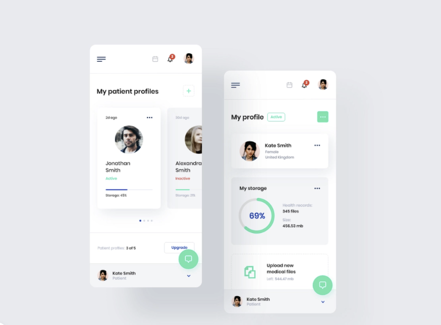

# Medical App UI Template made using Ionic 5 and Angular

You can use this Ionic UI template to quick start your medical App development.

# How to set up your Environment

* Make sure you have node.js Installed
* Make sure you have ionic/cli installed

# Running the project

* After cloning run, npm install
* Then run, ionic serve

# UI CREDITS TO:
  * MATT WOJTAS from dribble.com

#Main UI screenshots

